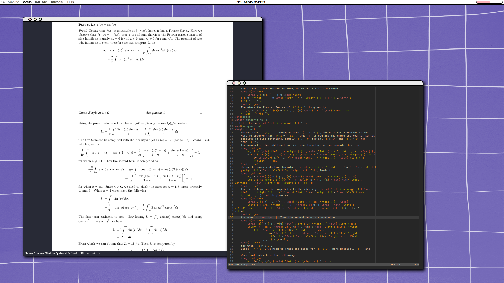
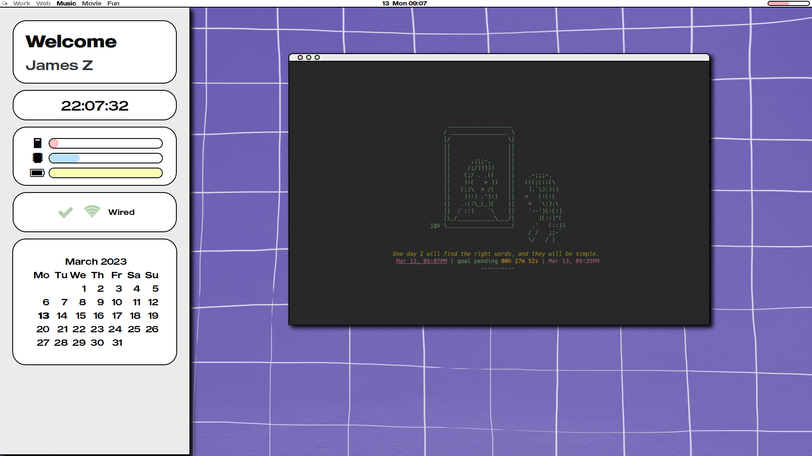

# awesome-WM_config-

This project file showcases my current Awesome Window Manager (WM) setup, commonly referred to as a "rice" in the Linux community, written in Lua. This setup is designed to provide a visually appealing and efficient workspace for my personal use.

## Features

My setup includes the following features:

- A custom theme with soft and pleasant design elements
- Keybindings that I have customized for my personal workflow
- Widgets for displaying system information such as battery life, CPU usage, and memory usage
- Support for multiple workspaces with customizable layouts

## Lua Programming Language

The setup is written in Lua, a lightweight and powerful programming language. Lua is well-suited for scripting and is widely used in the gaming industry for its speed and flexibility.

## Conclusion

Overall, my Awesome WM titling rice setup provides me with a highly customized and efficient workspace that caters to my specific needs. With its visually appealing design and efficient functionality, I am able to maximize productivity and make using the computer a more enjoyable experience. Feel free to take inspiration from my setup and customize it to your liking!

